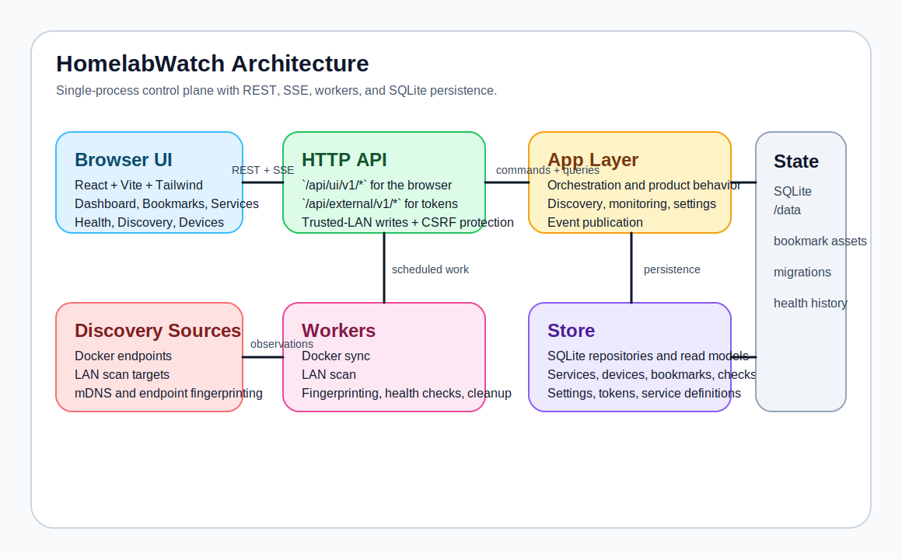
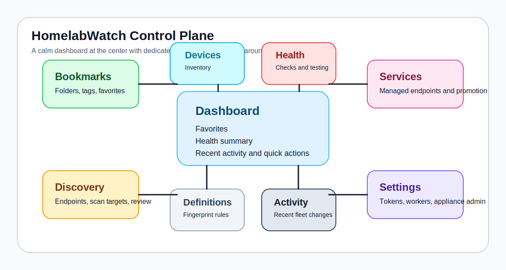

# HomelabWatch

HomelabWatch is a self-hosted homelab discovery and monitoring control plane.
It runs as a single Go service, stores state in SQLite, serves a React frontend,
and combines discovery, health monitoring, bookmarks, device inventory, and
service fingerprinting in one deployable container.



## What It Does

- calm dashboard focused on favorites, fleet status, and recent activity
- dedicated management screens for bookmarks, services, health, discovery,
  devices, service definitions, and settings
- Docker and LAN discovery with promotion from discovered services into managed
  services and bookmarks
- device inventory keyed by stable identity when possible, with MAC-aware reuse
- health monitoring for HTTP, TCP, and ping checks
- separate open URL and health URL targeting for services that should be
  checked on a different endpoint than the one users open
- endpoint testing before saving health-check changes
- built-in service definitions for common homelab apps, plus custom
  SQLite-backed definitions managed from the UI and API
- first-run setup wizard instead of admin-token copy/paste in the browser
- scoped external API tokens for automation
- live UI updates over SSE
- single-container deployment with automatic SQLite migrations

## Product Surfaces



- `Dashboard`: favorites, health summary, recent activity, and limited quick
  actions
- `Bookmarks`: curated links, folders, tags, favorites, import/export
- `Services`: accepted endpoints, open URLs, Docker workloads, bookmark
  promotion
- `Health`: monitoring status, check editing, endpoint testing, health-target
  configuration
- `Discovery`: Docker endpoints, scan targets, policy, and discovered-service
  review
- `Devices`: device inventory, IPs, MACs, visibility, attached services
- `Definitions`: fingerprinting rules and managed health-check templates
- `Settings`: appliance state, API tokens, and worker status

## Stack

- Backend: Go, REST, SSE, in-process background workers
- Persistence: SQLite
- Frontend: React, Vite, Tailwind CSS
- Packaging: multi-stage Docker build, Go serves the built frontend

## Quick Start

### Make Targets

```bash
make help
make web-install
make web-build
make test
make build
make run
make docker-build
make release-check
make release-snapshot
```

### Run With Docker

Build the local image:

```bash
make docker-build
```

Run it:

```bash
docker run --rm \
  -p 8080:8080 \
  -v "$(pwd)/data:/data" \
  -v /var/run/docker.sock:/var/run/docker.sock \
  homelabwatch:local
```

Then open `http://localhost:8080`.

On a fresh `/data` volume, HomelabWatch starts with a setup wizard in the
browser. The UI stays open for trusted LAN clients. External automation tokens
are created later from `Settings > API access`.

### Run With Docker Compose

The repository includes [`docker-compose.example.yml`](docker-compose.example.yml).

Typical flow:

```bash
cp docker-compose.example.yml docker-compose.yml
docker compose up -d
```

### Linux Discovery Notes

For LAN discovery and ping checks on Linux, host networking and raw socket
access are usually required:

```bash
docker run --rm \
  --network host \
  --cap-add NET_RAW \
  -v "$(pwd)/data:/data" \
  -v /var/run/docker.sock:/var/run/docker.sock \
  homelabwatch:local
```

### Run Locally

Install dependencies and build the frontend:

```bash
make web-install
make web-build
```

Run the backend:

```bash
make run
```

The browser UI expects same-origin API requests. `npm run dev` is available for
frontend-only work, but you will need a dev proxy if you want Vite to point at
the Go API.

## Configuration

Configuration can come from `config.yaml` / `config.yml` or environment
variables.

Example config: [`config.example.yaml`](config.example.yaml)

Important environment variables:

- `HOMELABWATCH_LISTEN_ADDR`
- `HOMELABWATCH_DATA_DIR`
- `HOMELABWATCH_DB_PATH`
- `HOMELABWATCH_STATIC_DIR`
- `HOMELABWATCH_CONFIG`
- `HOMELABWATCH_SEED_CIDRS`
- `HOMELABWATCH_DEFAULT_SCAN_PORTS`
- `HOMELABWATCH_SEED_DOCKER_SOCKET`
- `HOMELABWATCH_TRUSTED_CIDRS`

Example trust-boundary override:

```bash
HOMELABWATCH_TRUSTED_CIDRS=127.0.0.1/32,192.168.1.0/24
```

## Security Model

HomelabWatch is designed for trusted local and LAN environments.

- The browser UI has no sign-in screen by product design.
- UI reads are open.
- UI writes require all of:
  - a client IP inside `HOMELABWATCH_TRUSTED_CIDRS`
  - same-origin browser requests
  - the server-issued console CSRF token
- External clients should use managed bearer tokens against
  `/api/external/v1/*`.
- Legacy `/api/v1/*` token-auth endpoints remain for compatibility.

If you expose the app outside your local network, put it behind a reverse proxy
or VPN and tighten `HOMELABWATCH_TRUSTED_CIDRS`.

Additional guidance lives in [`SECURITY.md`](SECURITY.md).

## Health Monitoring

HomelabWatch does not assume every HTTP service is healthy at `/`.

Each service can keep a user-facing open URL and a separate health target.
That lets operators open an app at one address while checking a more reliable
path or port for monitoring.

Each HTTP check can define:

- `protocol`
- `host`
- `port`
- `path`
- `method`
- `expectedStatusMin` and `expectedStatusMax`
- `timeoutSeconds`
- `intervalSeconds`

Operators can:

- create multiple checks per service
- choose HTTP, TCP, or ping checks
- keep the service open URL and health URL separate
- test a candidate endpoint before saving
- switch a service from auto-managed checks to custom checks by editing it

The endpoint tester returns:

- resolved URL
- HTTP status
- latency
- response size
- matched service definition, when one is recognized

## Service Definitions And Fingerprinting

Built-in definitions currently include:

- Pi-hole
- Grafana
- Prometheus
- Home Assistant
- Plex

Definitions drive:

- default ports
- default health paths
- icon selection
- automatic health-check provisioning
- fingerprint scoring

Fingerprinting uses a mix of:

- exposed port hints
- container image names and labels
- mDNS metadata
- HTTP response headers
- page titles
- body substrings

Unknown services do not get aggressive background path probing. Known matches
receive definition-driven HTTP checks. Unmatched services fall back to TCP or
ping. Smart path discovery happens when the operator runs `Test endpoint` with
a blank HTTP path.

Custom service definitions are supported through the UI and API and are stored
in SQLite. YAML-backed runtime custom definitions are not part of the current
runtime.

## Discovery And Promotion Behavior

- Discovered services are fingerprinted in the background.
- Accepted discovered services preserve managed health checks and recent health
  history when promoted into first-class services and bookmarks.
- Service-definition reapply only updates services still in `auto` mode.
- User-edited services stay in `custom` mode and are not overwritten by later
  definition refreshes.

## API Notes

- Browser UI API: `/api/ui/v1/*`
- External automation API: `/api/external/v1/*`
- Legacy compatibility API: `/api/v1/*`
- UI event stream: `GET /api/ui/v1/events`

Health endpoints:

- `GET /api/ui/v1/services/{id}/checks`
- `POST /api/ui/v1/services/{id}/checks`
- `PATCH /api/ui/v1/checks/{id}`
- `DELETE /api/ui/v1/checks/{id}`
- `POST /api/ui/v1/services/{id}/checks/test`

Service-definition endpoints:

- `GET /api/ui/v1/service-definitions`
- `POST /api/ui/v1/service-definitions`
- `PATCH /api/ui/v1/service-definitions/{id}`
- `DELETE /api/ui/v1/service-definitions/{id}`
- `POST /api/ui/v1/service-definitions/{id}/reapply`

Common external API flow:

1. Open the UI and finish setup.
2. Go to `Settings > API access`.
3. Create a read or write token.
4. Call `/api/external/v1/*` with `Authorization: Bearer <token>`.

## Project Structure

### Frontend

```text
web/src/
  App.jsx
  app/
    AppShell.jsx
    routes.js
    screens/
  components/
    bookmarks/
    bootstrap/
    dashboard/
    discovery/
    forms/
    health/
    layout/
    ui/
  hooks/
    useBookmarksData.js
    useDashboardData.js
    useHomelabwatchApp.js
    useServerEvents.js
    useSettingsData.js
    useUIBootstrap.js
  lib/
  main.jsx
```

### Backend

```text
cmd/homelabwatch
internal/api/http
internal/api/sse
internal/app
internal/discovery
internal/domain
internal/events
internal/monitoring
internal/servicedefs
internal/store/sqlite
internal/worker
migrations
```

More detail:

- [`docs/architecture.md`](docs/architecture.md)
- [`docs/domain-model.md`](docs/domain-model.md)
- [`docs/launch-readiness.md`](docs/launch-readiness.md)
- [`docs/operations.md`](docs/operations.md)

## Docs And Community

- [`CONTRIBUTING.md`](CONTRIBUTING.md)
- [`SECURITY.md`](SECURITY.md)
- [`ROADMAP.md`](ROADMAP.md)
- [`CHANGELOG.md`](CHANGELOG.md)
- [`CODE_OF_CONDUCT.md`](CODE_OF_CONDUCT.md)
- [`DOCKERHUB.md`](DOCKERHUB.md)

## Verification

Useful checks:

```bash
go test ./...
cd web && npm run build
make docker-build
```

For release validation:

```bash
make release-check
make release-snapshot
```

`make release-snapshot` expects Docker, Buildx, and GoReleaser to be installed
locally because it validates the multi-platform release packaging too.

## Release Automation

GitHub releases are automated with GitHub Actions and GoReleaser.

- CI runs frontend build and Go tests on pushes and pull requests.
- Publishing a GitHub release builds Linux binaries and multi-platform Docker
  images.
- Stable releases publish Docker tags `vX.Y.Z`, `X.Y`, `X`, and `latest`.
- Prereleases publish only the exact version tag.
