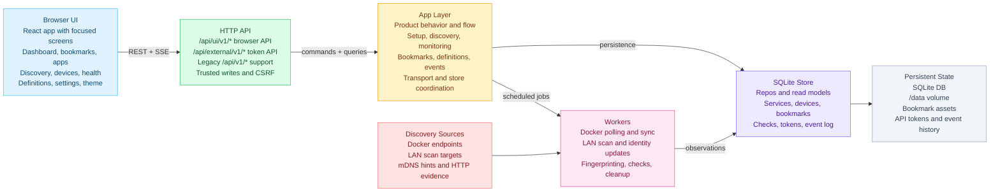

# Architecture Overview

HomelabWatch is a single-process control plane:

- Go serves the API and the built frontend
- SQLite stores operational state
- background workers handle discovery, fingerprinting, monitoring, and cleanup
- the browser UI consumes REST plus SSE from the same origin

## Runtime Shape

1. The browser loads the React bundle served by the Go process.
2. The UI bootstraps from `/api/ui/v1/bootstrap`.
3. Screen-level data is loaded from REST endpoints under `/api/ui/v1/*`.
4. Background workers update discovery, health, and activity state.
5. The backend publishes SSE events to `/api/ui/v1/events`.
6. The frontend refreshes only the affected feature slices.

## Backend Boundaries

### `internal/api/http`

- `router.go`: router assembly, static serving, shared HTTP helpers
- `routes.go`: route registration tables for UI and token-auth surfaces
- handler files such as `bookmarks.go`, `bootstrap_handlers.go`,
  `discovery_handlers.go`, `inventory_handlers.go`, and
  `service_definitions.go`: resource handlers split by concern
- `security.go`: trusted-network, same-origin, CSRF, and token middleware

Rules:

- handlers decode requests, call app services, and shape HTTP responses
- handlers should not own persistence or business rules

### `internal/api/sse`

- dedicated SSE transport package
- streams `domain.EventEnvelope` without mixing event formatting into the HTTP
  router

### `internal/app`

- owns orchestration and product behavior
- coordinates persistence, discovery providers, monitoring, and event
  publication
- should remain the place where "what happens when the user does X" lives

Current note:

- `app.go` is still the main orchestration hub
- specialized files such as `bookmarks.go`, `discovered_services.go`, and
  `service_definitions.go` already reduce some pressure

### `internal/domain`

- shared types used across store, app, and API
- entity and payload definitions for services, devices, health checks,
  bookmarks, settings, discovery inputs, and API tokens

Constraint:

- `domain` currently mixes entity shapes and read-model payloads such as
  `Dashboard` and `SettingsView`
- keep changes incremental and avoid introducing a second parallel model layer
  without a concrete need

### `internal/store/sqlite`

- SQLite schema, migrations, queries, and persistence logic
- current repository and read-model implementation

Current note:

- the store still owns some broad read models and aggregation work
- future cleanup should continue splitting by concern without changing the
  deployment model or abandoning SQLite

## Frontend Boundaries

### `web/src/app`

- `App.jsx`: root composition
- `AppShell.jsx`: shared chrome, nav, metrics rail, global actions
- `routes.js`: route metadata
- `screens/*`: route-level ownership for the main product surfaces

### `web/src/hooks`

- `useUIBootstrap.js`: first-run bootstrap, CSRF, trust boundary state
- `useDashboardData.js`: overview/dashboard data
- `useBookmarksData.js`: bookmarks, folders, tags, workspace data
- `useBookmarksWorkspace.js`: client-side bookmark filtering, favorites, and
  folder-tree shaping
- `useSettingsData.js`: settings-centric data
- `useServerEvents.js`: SSE integration and targeted refresh scheduling
- `useThemePreference.js`: persisted light/dark theme preference
- `useHomelabwatchApp.js`: composition of the smaller hooks

### `web/src/components`

- `ui/*`: generic presentation primitives
- `layout/*`: shell-level layout pieces
- `dashboard/*`: reusable sections that are now consumed by dedicated screens
- `bookmarks/*`, `discovery/*`, `folders/*`, `health/*`, `tags/*`, `forms/*`:
  feature-specific UI
- `bootstrap/*`: first-run setup flow UI

Current note:

- the app has moved to screen ownership
- some feature UI still lives under shared component folders and can continue
  moving closer to owning screens incrementally

## Event Flow

HomelabWatch uses SSE as an invalidation channel rather than a full state-sync
protocol.

- workers publish events through `internal/events`
- the SSE handler streams `domain.EventEnvelope`
- the frontend maps event types to targeted refresh callbacks
- full `refreshAll` remains available for explicit user refresh, not as the
  primary background sync mechanism

## Operational Principles

- keep the single-container deployment path first-class
- keep browser writes limited to trusted networks plus same-origin plus CSRF
- preserve `/api/v1/*` and `/api/external/v1/*` compatibility unless a change
  explicitly allows a break
- prefer additive read-model cleanup over endpoint rewrites
